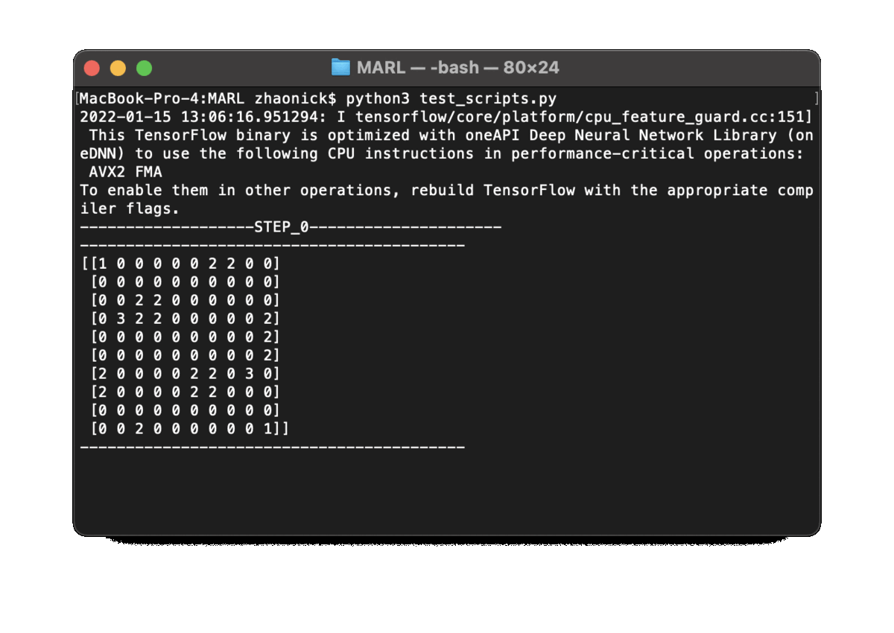

## policy gradient (reinforce) solution

- each agent only observes its surrounding cells to mimic limited view range and reduce input dimension
  - each agent also observes all goal locations relative to itself
- off-policy training at the end of each episode by doing PG ascent on recorded steps and rewards (Monte Carlo)
  - entropy term on policy diversity added to loss to encourage exploration
- homogenous agents, so the same PG network can be usd for all agents
- PG network separated into two sub-networks -- one taking in just the surrounding cells, and the other taking in just the relative goal locations
  - outputs from the two sub-networks are concatenated and passed through a final softmax layer to get the policy

## DQN solution

- prioritized experience replay with importance samping and sum tree
- target network from double DQN
- demo agent trained on map1 ONLY with fixed bot and goal positions
  - state space becomes too difficult after allowing random bot and goal positions
    - need better state design?

## local PG + global DQN
